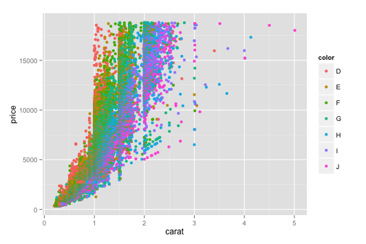

## Plotting with Base Graphics

#### 1. Histogram

```{r}
library(datasets)

hist(mtcars$disp)
hist(mtcars$disp, breaks=100, col="Green")

## density instead of frequency

hist(mtcars$disp, breaks=100, col="Green", freq=FALSE)

## density plot
d <- density(mtcars$mpg) ## saving the density output in a variable
plot(d) # intelligently plots the results

## filled density plot

d <- density(mtcars$mpg)
plot(d, main="Kernel Density of Miles Per Gallon")
polygon(d, col="red", border="blue")
```

#### 2. Scatterplot

```{r}
## population vs income
plot(state.x77[,1], state.x77[,2])

## adding plot title
plot(state.x77[,1], state.x77[,2], main = "Population vs Income")

#### adding x and y labels - xlab and ylab
plot(state.x77[,1], state.x77[,2], xlab="Population", ylab="Income")

#### adding color - color number
plot(state.x77[,1], state.x77[,2], xlab="Population", ylab="Income", col=2)

#### adding color - with name
plot(state.x77[,1], state.x77[,2], xlab="Population", ylab="Income", col="blue")

#### pch

## changing type of point using pch
plot(state.x77[,1], state.x77[,2], xlab="Population", ylab="Income", col=3, pch=20)

#### cex

## controlling size of symbols using cex

### cex = 0.8
plot(state.x77[,1], state.x77[,2], xlab="Population", ylab="Income", col=3, pch=20, cex = 0.8)

### cex = 1.8
plot(state.x77[,1], state.x77[,2], xlab="Population", ylab="Income", col=3, pch=20, cex = 1.8)

```

##### 3. Line graphs

```{r}
## line plots
plot(state.x77[,1], state.x77[,2], xlab="Population", ylab="Income", col=3, type="l")

## points and lines
plot(state.x77[,1], state.x77[,2], xlab="Population", ylab="Income", col=3, type="b")

## line type
plot(state.x77[,1], state.x77[,2], xlab="Population", ylab="Income", col=3, type="b", lty=2)

## different line type
plot(state.x77[,1], state.x77[,2], xlab="Population", ylab="Income", col=3, type="b", lty=4)

## line width
plot(state.x77[,1], state.x77[,2], xlab="Population", ylab="Income", col=3, type="b", lty=4, lwd=2)

## abline
plot(state.x77[,1], state.x77[,2], xlab="Population", ylab="Income", col=3)
abline(h=4000,col="red")
abline(v=7000,col="blue", lty=3, lwd=4)

plot(state.x77[,1], state.x77[,2], xlab="Population", ylab="Income", col=3)
model <- lm(state.x77[,2] ~ state.x77[,1])
abline(model, lwd=2, lty=3)
```

#### labelling points

```{r}
## Example of labeling points

plot(mtcars$wt, mtcars$mpg, main="Mileage vs. Car Weight", 
  	xlab="Weight", ylab="Mileage", pch=18, col="blue")
text(mtcars$wt, mtcars$mpg, row.names(mtcars), cex=0.6, pos=4, col="red")
```


#### Illustrating all ```type=``` values

```{r}
x <- c(1:5); y <- x # create some data 
par(pch=22, col="red") # plotting symbol and color 
par(mfrow=c(2,4)) # all plots on one page 
opts = c("p","l","o","b","c","s","S","h") 
for(i in 1:length(opts)){ 
  heading = paste("type=",opts[i]) 
  plot(x, y, type="n", main=heading) 
  lines(x, y, type=opts[i]) 
}
```

#### 4. Boxplot

```{r}
library(datasets)
boxplot(state.x77)
boxplot(scale(state.x77))

## population
boxplot(state.x77[,1], ylab="Population")
title("Boxplot of State Populations")

# Boxplot of MPG by Car Cylinders 
boxplot(mpg~cyl,data=mtcars, main="Car Milage Data", 
  	xlab="Number of Cylinders", ylab="Miles Per Gallon")

```

---

#### 5. Multiple plots on screen

```{r}
## Row-wise
par(mfrow=c(2,1))
plot(state.x77[,1], state.x77[,2], xlab="Population", ylab="Income", col=3)

plot(state.x77[,1], ylab="Population")
```

```{r}
## Column-wise
par(mfcol=c(1,2))
plot(state.x77[,1], state.x77[,2], xlab="Population", ylab="Income", col=3)

plot(state.x77[,1], ylab="Population")

plot(state.x77[,2], ylab="Income")

par(mfcol=c(1,1))
```

---


#### 6. Matrix plots using ```matplot```

```{r}
JohnsonJohnson

class(JohnsonJohnson)

m <- matrix(JohnsonJohnson, ncol=4, byrow = TRUE)
m

matplot(m, type="l")
```

#### 7. ```Q-Q Plots```
 
```{r}
# Q-Q plots
x1 <- rnorm(100)

qqnorm(x1)
qqline(x1)

# Comparing 2 distributions
par(mfrow=c(1,2))

x <- rt(100, df=3)
# normal fit
qqnorm(x); qqline(x)

# t(3Df) fit 
qqplot(rt(1000,df=3), x, main="t(3) Q-Q Plot", 
   ylab="Sample Quantiles")
abline(0,1)
```

Interpreting QQ Plots: http://stats.stackexchange.com/a/101290/21450

---

### Key Parameters
        
Many base plotting functions share a set of parameters. Here are a few key ones:

+ __pch__: the plotting symbol (default is open circle)
+ __lty__: the line type (default is solid line)
+ __lwd__: the line width, specified as an integer multiple
+ __col__: plotting color
+ __main__: main plot title
+ __xlab__: x-axis label
+ __ylab__: y-axis label

References:

1. pch: 0 to 25 (refer: http://www.endmemo.com/program/R/pchsymbols.php)
2. lty: 1 to 6
3. lwd: 1 to 8

---

# Intro to ```ggplot2```

```{r}
library(ggplot2)

ggplot(data=mtcars, aes(x=wt, y=mpg)) + 
    geom_point() + 
    labs(title="Automobile Data", x="Weight", y="Miles Per Gallon")

```

+ ggplot
    + Based on Graphics of Grammar
        + data (in data frame format)
        + geometry of one or multiple aesthetics

+ geom
    + short for ```Geometric objects```
        + includes 
            + points
            + lines
            + bars
            + boxplots
            + density plots
+ aes
    + how the information is represented visually
    + options in aes() - specifies what role each variable will play
+ Optional annotations

---

## Common options in geom functions

+ color
+ fill
+ alpha
    + 0: transparent
    + 1: opaque
+ linetype
    + 1 to 6
+ size
+ shape
+ binwidth
+ width
+ position
    + dodge
    + stacked
    + fill
    + jitter

---

## Colors

```{r}
ggplot(data=mtcars, aes(x=wt, y=mpg, color=cyl)) + 
    geom_point(size=5) + 
    labs(title="Automobile Data", x="Weight", y="Miles Per Gallon")

ggplot(data=mtcars, aes(x=wt, y=mpg, color=factor(cyl))) + 
    geom_point() + 
    labs(title="Automobile Data", x="Weight", y="Miles Per Gallon")

ggplot(data=mtcars, aes(x=wt, y=mpg, color=factor(cyl))) + 
    geom_point(color="red") + 
    labs(title="Automobile Data", x="Weight", y="Miles Per Gallon")
```

---

## Exercise

Use ```diamonds``` dataset and plot this image



---

## Histograms

```{r}
library(lattice)

ggplot(singer, aes(x=height)) + 
    geom_histogram()

ggplot(singer, aes(x=height)) + 
    geom_histogram(binwidth = 2)

```

---

## Box plots

```{r}
ggplot(singer, aes(x=voice.part, y=height)) + 
    geom_boxplot()
```

---

## Bar plots

```{r}
data(Salaries, package="car")

ggplot(Salaries, aes(x=rank, fill=sex)) + 
    geom_bar(position="stack") + 
    labs(title='position="stack"') 

ggplot(Salaries, aes(x=rank, fill=sex)) + 
    geom_bar(position="dodge") + 
    labs(title='position="dodge"') 

ggplot(Salaries, aes(x=rank, fill=sex)) + 
    geom_bar(position="fill") + 
    labs(title='position="fill"')

ggplot(Salaries, aes(x=rank, fill=sex)) + 
    geom_bar(position="fill") + 
    labs(title='position="fill"') + 
    coord_flip()

ggplot(Salaries, aes(x=rank, fill=sex)) + 
    geom_bar(position="dodge") + 
    labs(title='position="dodge"') + 
    scale_fill_grey(start = 0, end = 1)
```

---

## Scatter plots

```{r}
ggplot(Salaries, aes(x=rank, y=salary, color=sex)) + 
    geom_point()

ggplot(Salaries, aes(x=rank, y=salary, color=sex)) + 
    geom_point(position="jitter", size = 3)

ggplot(Salaries, aes(x=rank, y=salary, color=sex)) + 
    geom_jitter(size = 3)

ggplot(Salaries, aes(x=rank, y=salary, color=sex)) + 
    geom_jitter(aes(shape = sex), size = 3)

ggplot(Salaries, aes(x=yrs.service, y=salary)) + 
    geom_jitter(size = 3) + 
    geom_smooth(method=lm)
```

---

## Line plots

```{r}
JohnsonJohnson

jj <- matrix(JohnsonJohnson, ncol = 4, byrow = TRUE)

jj <- cbind(matrix(1960:1980),jj)

colnames(jj) <- c("Year","Q1", "Q2", "Q3", "Q4")

jj <- data.frame(jj)

ggplot(jj,aes(x=Year,y=Q1)) + 
    geom_line()


### illustrating example of reshaping data for ggplot plotting
library(reshape2)

melt_jj <- melt(jj, id.vars = "Year")

ggplot(melt_jj, aes(x=Year, y = value, color=variable)) + 
    geom_line()
```

---

## Grouping

```{r}
data(Salaries, package="car")
library(ggplot2)

ggplot(Salaries, aes(x=salary)) + 
    geom_density(alpha=0.3)

ggplot(Salaries, aes(x=salary, fill=rank)) + 
    geom_density(alpha=0.3)

ggplot(Salaries, aes(x=yrs.since.phd, y=salary, shape=sex, color=rank )) + 
    geom_point(size=3)

```

---

## Faceting

#### Using ```facet_wrap```

```{r warning=FALSE, message=FALSE}
data(singer, package="lattice") 
library(ggplot2) 

ggplot(data=singer, aes(x=height)) + 
    geom_histogram() + 
    facet_wrap(~voice.part, nrow=4)
```

#### Using ```facet_grid```

```{r}

m <- mtcars

m$am <- factor(m$am, levels=c(0,1), labels=c("Automatic", "Manual")) 

m$vs <- factor(m$vs, levels=c(0,1), labels=c("V-Engine", "Straight Engine")) 

m$cyl <- factor(m$cyl)

ggplot(data=m, aes(x=hp, y=mpg, shape=cyl, color=cyl)) + 
    geom_point(size=3) + 
    facet_grid(am~vs) + 
    labs(title="Automobile Data by Engine Type", 
         x="Horse Power", y="Miles Per Gallon")
```

---

## Arranging Plots into Grids

Install the ```gridExtra``` package

```{r}
library(gridExtra)

p1 <- ggplot(data=mtcars, aes(x=wt, y=mpg, color=factor(cyl))) + 
    geom_point(pch=17, color="blue", size=2) + 
    geom_smooth(method="lm", color="red", linetype=2) + 
    labs(title="Automobile Data", x="Weight", y="Miles Per Gallon")

p2 <- ggplot(data=mtcars, aes(x=wt, y=mpg, color=factor(cyl))) + 
    geom_point(pch=17, color="blue", size=2) + 
    geom_smooth(method="loess", color="red", linetype=2) + 
    labs(title="Automobile Data", x="Weight", y="Miles Per Gallon")

grid.arrange(p1,p2,ncol=2)

grid.arrange(p1,p2,nrow=2)
```

---

## Modifying the appearance of ggplot2 graphs

+ Axes
+ Legends
+ Scales
+ Themes

---

## Saving plots to disk

```{r}
ggplot(mtcars,aes(x=wt, y=hp)) + 
    geom_point()
ggsave("myplot.pdf")
ggsave("myplot.png")
```