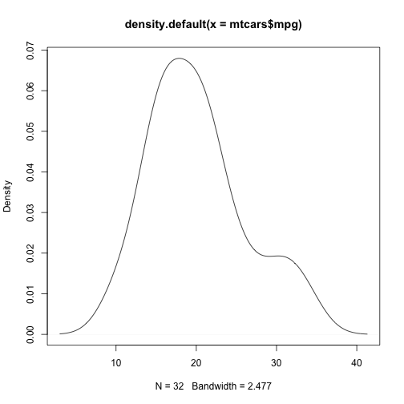
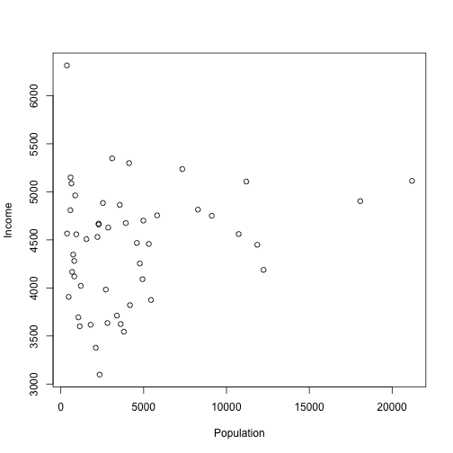
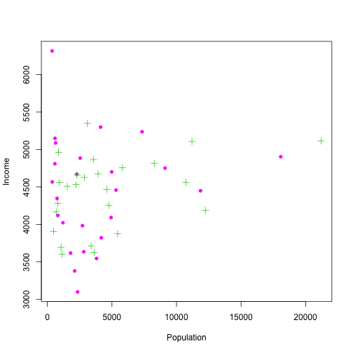
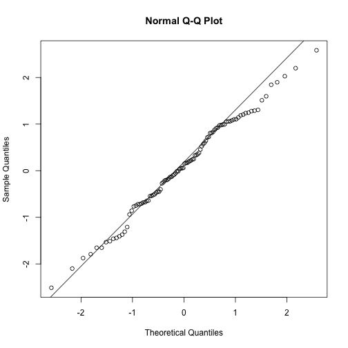
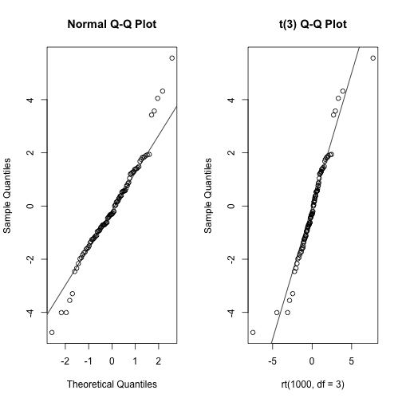

Materials for this class are adapted from the Johns Hopkins Coursera class on EDA by Prof. Roger Peng

## Base Plotting System

+ Uses "Artist's Palette" model
+ Good for fast exploratory data analysis
+ Start with a plot() function
+ Add annotation functions: text, lines, points, axes
+ Also title, labels, abline, color

Drawbacks:

+ Need to plan in advance, can't change margins etc. once plotting starts


```r
library(datasets)
data(cars)

with(cars, plot(speed,dist))
```

 

---

## Lattice Plotting System

+ Plots created with a single function call (xyplot, bwplot etc.)
+ Good for conditional type plotting
    + Eg. How does Y change wrt X across Z levels
+ Good for plotting multiple plots on a single screen
+ Margins set automatically

Drawbacks:

+ Awkward to specify entire plot in single function call
+ Difficult to annotate (compared to base and ggplot2)
+ Need to prepare the panelling of plots before-hand
+ Cannot add layer to plot once created


```r
library(lattice)

state <- data.frame(state.x77, region=state.region)
xyplot(Life.Exp ~ Income | region, data=state, layout = c(4,1))
```

 

---

## Using ```ggplot2```

+ Based on "Grammar of Graphics" by Leland Wilkinson
+ Combines elements of Base and Lattice plotting
+ Automatically deals with spacings, but also allows you to add layers
+ Highly customizable

#### Without layering


```r
library(ggplot2)

data(mpg)

qplot(displ, hwy, data = mpg)
```

 

#### With layering


```r
ggplot(mpg, aes(x=displ, y=hwy)) + 
    geom_point() + 
    xlab("Displacement") + 
    ylab("Highway mileage")
```

 

---

## Plotting with Base Graphics

#### histogram


```r
library(datasets)

hist(AirPassengers)
```

 

```r
hist(mtcars$disp)
```

 

```r
hist(mtcars$disp, breaks=100, col="Green")
```

 

```r
## density instead of frequency

hist(mtcars$disp, breaks=100, col="Green", freq=FALSE)
```

 

```r
## density plot
d <- density(mtcars$mpg)
plot(d) # plots the results
```

 

```r
## filled density plot

d <- density(mtcars$mpg)
plot(d, main="Kernel Density of Miles Per Gallon")
polygon(d, col="red", border="blue")
```

 

### Key Parameters

Many base plotting functions share a set of parameters. Here are a few key ones:

+ ```pch```: the plotting symbol (default is open circle)
+ ```lty```: the line type (default is solid line), can be dashed, dotted, etc.
+ ```lwd```: the line width, specified as an integer multiple
+ ```col```: the plotting color, specified as a number, string, or hex code; the ```colors()``` function gives you a vector of colors by name
+ ```xlab```: character string for the x-axis label
+ ```ylab```: character string for the y-axis label

#### scatterplot


```r
## population vs income
plot(state.x77[,1], state.x77[,2])
```

 

```r
#### adding x and y labels - xlab and ylab
plot(state.x77[,1], state.x77[,2], xlab="Population", ylab="Income")
```

 

```r
#### adding color - col
plot(state.x77[,1], state.x77[,2], xlab="Population", ylab="Income", col=c(3,6))
```

 

```r
#### pch

## changing type of point using pch
plot(state.x77[,1], state.x77[,2], xlab="Population", ylab="Income", col=c(3,6), pch=20)
```

 

```r
## different point types for different variables
plot(state.x77[,1], state.x77[,2], xlab="Population", ylab="Income", col=c(3,6), pch=c(3,20))
```

 

```r
#### cex

## controlling size of symbols using ces
plot(state.x77[,1], state.x77[,2], xlab="Population", ylab="Income", col=c(3,6), pch=c(3,20), cex=0.8)
```

 

```r
plot(state.x77[,1], state.x77[,2], xlab="Population", ylab="Income", col=c(3,6), pch=c(3,20), cex=1.2)
```

 

##### line graphs


```r
## line plots
plot(state.x77[,1], state.x77[,2], xlab="Population", ylab="Income", col=c(3,6), type="l")
```

 

```r
## points and lines
plot(state.x77[,1], state.x77[,2], xlab="Population", ylab="Income", col=c(3,6), type="b")
```

 

```r
## line type
plot(state.x77[,1], state.x77[,2], xlab="Population", ylab="Income", col=c(3,6), type="b", lty=2)
```

 

```r
## different line type
plot(state.x77[,1], state.x77[,2], xlab="Population", ylab="Income", col=c(3,6), type="b", lty=4)
```

 

```r
## line width
plot(state.x77[,1], state.x77[,2], xlab="Population", ylab="Income", col=c(3,6), type="b", lty=4, lwd=2)
```

 

```r
## abline
plot(state.x77[,1], state.x77[,2], xlab="Population", ylab="Income", col=c(3,6))
abline(h=4000,col="red")
abline(v=7000,col="blue", lty=3, lwd=4)
```

 

```r
plot(state.x77[,1], state.x77[,2], xlab="Population", ylab="Income", col=c(3,6))
model <- lm(state.x77[,2] ~ state.x77[,1])
abline(model, lwd=2, lty=3)
```

 

#### labelling points


```r
## Example of labeling points

plot(mtcars$wt, mtcars$mpg, main="Mileage vs. Car Weight", 
  	xlab="Weight", ylab="Mileage", pch=18, col="blue")
text(mtcars$wt, mtcars$mpg, row.names(mtcars), cex=0.6, pos=4, col="red")
```

 


#### Illustrating all ```type=``` values


```r
x <- c(1:5); y <- x # create some data 
par(pch=22, col="red") # plotting symbol and color 
par(mfrow=c(2,4)) # all plots on one page 
opts = c("p","l","o","b","c","s","S","h") 
for(i in 1:length(opts)){ 
  heading = paste("type=",opts[i]) 
  plot(x, y, type="n", main=heading) 
  lines(x, y, type=opts[i]) 
}
```

 

References:

1. pch: 0 to 25 (refer: http://www.endmemo.com/program/R/pchsymbols.php)
2. lty: 1 to 6
3. lwd: 1 to 8

#### boxplot


```r
library(datasets)
boxplot(state.x77)
```

 

```r
boxplot(scale(state.x77))
```

 

```r
## population
boxplot(state.x77[,1], ylab="Population")
title("Boxplot of State Populations")
```

 

```r
# Boxplot of MPG by Car Cylinders 
boxplot(mpg~cyl,data=mtcars, main="Car Milage Data", 
  	xlab="Number of Cylinders", ylab="Miles Per Gallon")
```

 

---

#### Multiple plots on screen


```r
## Row-wise
par(mfrow=c(2,1))
plot(state.x77[,1], state.x77[,2], xlab="Population", ylab="Income", col=c(3,6))

plot(state.x77[,1], ylab="Population")
```

 


```r
## Column-wise
par(mfcol=c(1,2))
plot(state.x77[,1], state.x77[,2], xlab="Population", ylab="Income", col=c(3,6))

plot(state.x77[,1], ylab="Population")
```

 

---


#### ```matplot```


```r
JohnsonJohnson
```

```
##       Qtr1  Qtr2  Qtr3  Qtr4
## 1960  0.71  0.63  0.85  0.44
## 1961  0.61  0.69  0.92  0.55
## 1962  0.72  0.77  0.92  0.60
## 1963  0.83  0.80  1.00  0.77
## 1964  0.92  1.00  1.24  1.00
## 1965  1.16  1.30  1.45  1.25
## 1966  1.26  1.38  1.86  1.56
## 1967  1.53  1.59  1.83  1.86
## 1968  1.53  2.07  2.34  2.25
## 1969  2.16  2.43  2.70  2.25
## 1970  2.79  3.42  3.69  3.60
## 1971  3.60  4.32  4.32  4.05
## 1972  4.86  5.04  5.04  4.41
## 1973  5.58  5.85  6.57  5.31
## 1974  6.03  6.39  6.93  5.85
## 1975  6.93  7.74  7.83  6.12
## 1976  7.74  8.91  8.28  6.84
## 1977  9.54 10.26  9.54  8.73
## 1978 11.88 12.06 12.15  8.91
## 1979 14.04 12.96 14.85  9.99
## 1980 16.20 14.67 16.02 11.61
```

```r
class(JohnsonJohnson)
```

```
## [1] "ts"
```

```r
m <- matrix(JohnsonJohnson, ncol=4, byrow = TRUE)
m
```

```
##        [,1]  [,2]  [,3]  [,4]
##  [1,]  0.71  0.63  0.85  0.44
##  [2,]  0.61  0.69  0.92  0.55
##  [3,]  0.72  0.77  0.92  0.60
##  [4,]  0.83  0.80  1.00  0.77
##  [5,]  0.92  1.00  1.24  1.00
##  [6,]  1.16  1.30  1.45  1.25
##  [7,]  1.26  1.38  1.86  1.56
##  [8,]  1.53  1.59  1.83  1.86
##  [9,]  1.53  2.07  2.34  2.25
## [10,]  2.16  2.43  2.70  2.25
## [11,]  2.79  3.42  3.69  3.60
## [12,]  3.60  4.32  4.32  4.05
## [13,]  4.86  5.04  5.04  4.41
## [14,]  5.58  5.85  6.57  5.31
## [15,]  6.03  6.39  6.93  5.85
## [16,]  6.93  7.74  7.83  6.12
## [17,]  7.74  8.91  8.28  6.84
## [18,]  9.54 10.26  9.54  8.73
## [19,] 11.88 12.06 12.15  8.91
## [20,] 14.04 12.96 14.85  9.99
## [21,] 16.20 14.67 16.02 11.61
```

```r
matplot(m, type="l")

matplot(m, type="l")
```

 

#### ```Q-Q Plots```
 

```r
# Q-Q plots
x1 <- rnorm(100)

qqnorm(x1)
qqline(x1)
```

 

```r
# Comparing 2 distributions
par(mfrow=c(1,2))

x <- rt(100, df=3)
# normal fit
qqnorm(x); qqline(x)

# t(3Df) fit 
qqplot(rt(1000,df=3), x, main="t(3) Q-Q Plot", 
   ylab="Sample Quantiles")
abline(0,1)
```

 

Interpreting QQ Plots: http://stats.stackexchange.com/a/101290/21450
