For today's session: Install the ```car``` and ```gridExtra``` packages.

References:

1. R in Action - Rob Kabacoff - http://manning.com/kabacoff2
2. R Graphics Cookbook - Winston Chang

---

## Intro to ```ggplot2```


```r
library(ggplot2)

ggplot(data=mtcars, aes(x=wt, y=mpg)) + 
    geom_point() + 
    labs(title="Automobile Data", x="Weight", y="Miles Per Gallon")
```

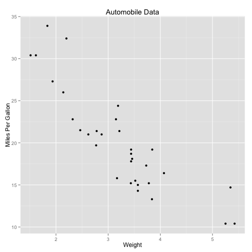 

+ ggplot
    + initializes plot
    + specifies dataset
    + specifies variables
    + *does not* provide visual output
+ aes
    + how the information is represented visually
    + options in aes() - specifies what role each variable will play
+ geom
    + short for ```Geometric objects```
        + includes 
            + points
            + lines
            + bars
            + boxplots
            + density plots
+ Optional annotations

---

## Colors


```r
ggplot(data=mtcars, aes(x=wt, y=mpg, color=cyl)) + 
    geom_point() + 
    labs(title="Automobile Data", x="Weight", y="Miles Per Gallon")
```

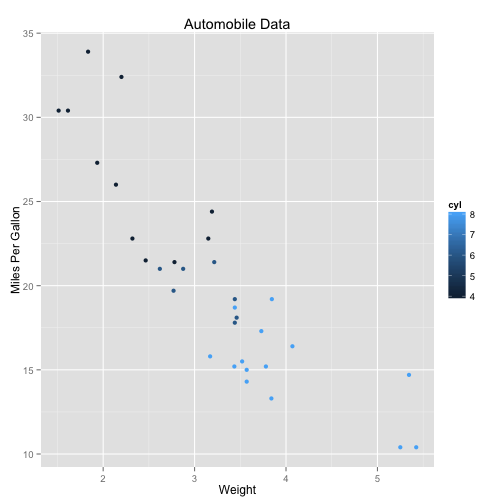 

```r
ggplot(data=mtcars, aes(x=wt, y=mpg, color=factor(cyl))) + 
    geom_point() + 
    labs(title="Automobile Data", x="Weight", y="Miles Per Gallon")
```

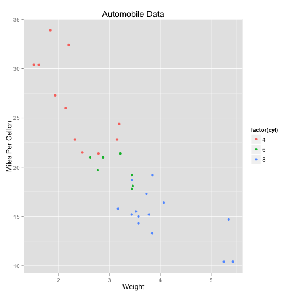 

```r
ggplot(data=mtcars, aes(x=wt, y=mpg, color=factor(cyl))) + 
    geom_point(color="blue") + 
    labs(title="Automobile Data", x="Weight", y="Miles Per Gallon")
```

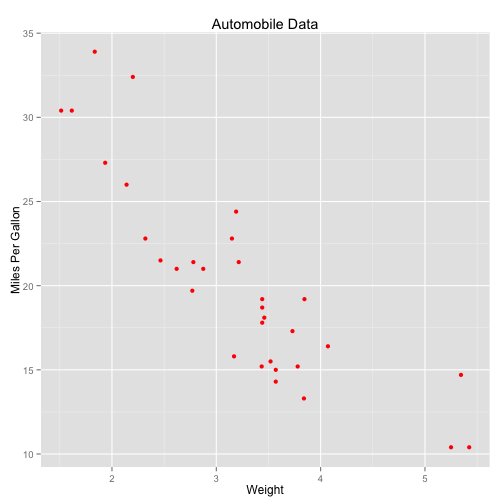 

---

## Exercise 1

Use ```diamonds``` dataset and plot this image


---

## Histograms


```r
library(lattice)

ggplot(singer, aes(x=height)) + 
    geom_histogram()
```

```
## stat_bin: binwidth defaulted to range/30. Use 'binwidth = x' to adjust this.
```

```
## Warning: position_stack requires constant width: output may be incorrect
```

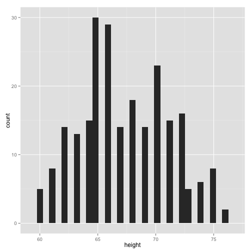 

```r
ggplot(singer, aes(x=height)) + 
    geom_histogram(binwidth = .5)
```

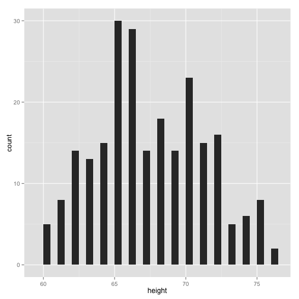 

---

## Box plots


```r
ggplot(singer, aes(x=voice.part, y=height)) + 
    geom_boxplot()
```

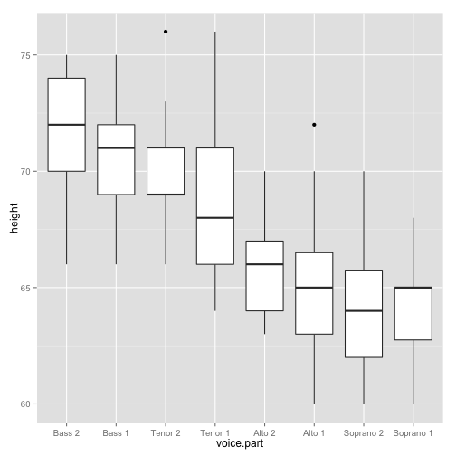 

---

## Bar plots


```r
data(Salaries, package="car")
ggplot(Salaries, aes(x=rank, fill=sex)) + 
    geom_bar(position="stack") + 
    labs(title='position="stack"') 
```

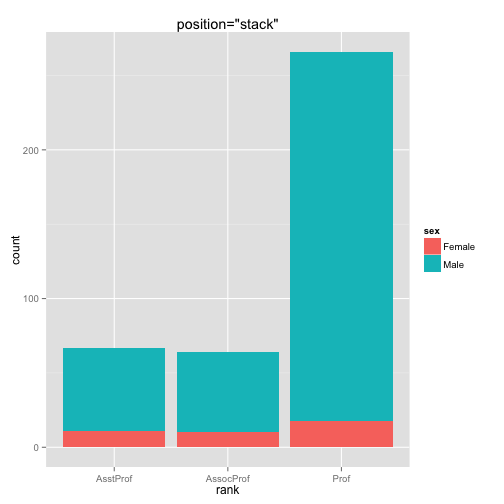 

```r
ggplot(Salaries, aes(x=rank, fill=sex)) + 
    geom_bar(position="dodge") + 
    labs(title='position="dodge"') 
```

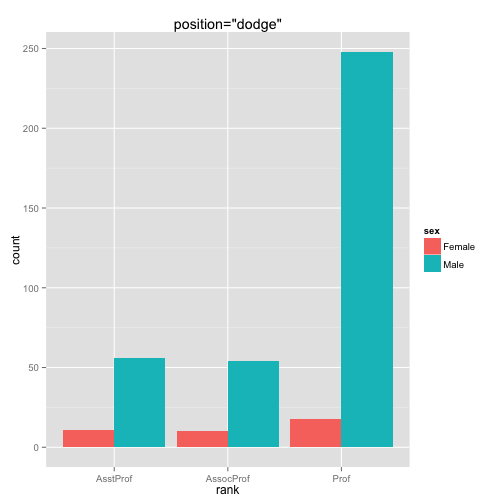 

```r
ggplot(Salaries, aes(x=rank, fill=sex)) + 
    geom_bar(position="fill") + 
    labs(title='position="fill"')
```

 

---

## Common options in geom functions

+ color
+ fill
+ alpha
    + 0: transparent
    + 1: opaque
+ linetype
    + 1 to 6
+ size
+ shape
+ binwidth
+ notch
    + TRUE / FALSE
+ sides
+ width
+ position
    + dodge
    + stacked
    + fill
    + jitter

---

## Line plots


```r
JohnsonJohnson
```

```
##       Qtr1  Qtr2  Qtr3  Qtr4
## 1960  0.71  0.63  0.85  0.44
## 1961  0.61  0.69  0.92  0.55
## 1962  0.72  0.77  0.92  0.60
## 1963  0.83  0.80  1.00  0.77
## 1964  0.92  1.00  1.24  1.00
## 1965  1.16  1.30  1.45  1.25
## 1966  1.26  1.38  1.86  1.56
## 1967  1.53  1.59  1.83  1.86
## 1968  1.53  2.07  2.34  2.25
## 1969  2.16  2.43  2.70  2.25
## 1970  2.79  3.42  3.69  3.60
## 1971  3.60  4.32  4.32  4.05
## 1972  4.86  5.04  5.04  4.41
## 1973  5.58  5.85  6.57  5.31
## 1974  6.03  6.39  6.93  5.85
## 1975  6.93  7.74  7.83  6.12
## 1976  7.74  8.91  8.28  6.84
## 1977  9.54 10.26  9.54  8.73
## 1978 11.88 12.06 12.15  8.91
## 1979 14.04 12.96 14.85  9.99
## 1980 16.20 14.67 16.02 11.61
```

```r
jj <- matrix(JohnsonJohnson, ncol = 4, byrow = TRUE)

jj <- cbind(matrix(1960:1980),jj)

colnames(jj) <- c("Year","Q1", "Q2", "Q3", "Q4")

jj <- data.frame(jj)

ggplot(jj,aes(x=Year,y=Q1)) + 
    geom_line()
```

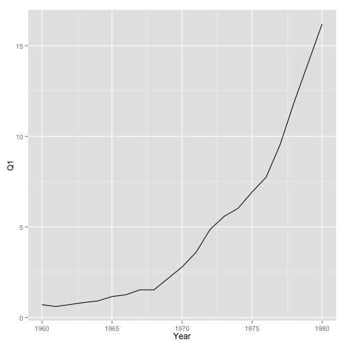 

```r
### illustrating example of reshaping data for ggplot plotting
library(reshape2)

melt_jj <- melt(jj, id.vars = "Year")

ggplot(melt_jj, aes(x=Year, y = value, color=variable)) + 
    geom_line()
```

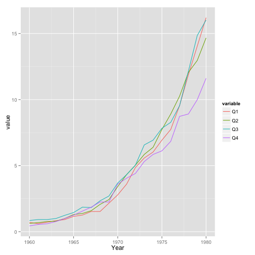 

---

## Grouping


```r
data(Salaries, package="car")
library(ggplot2)

ggplot(Salaries, aes(x=salary)) + 
    geom_density(alpha=0.3)
```

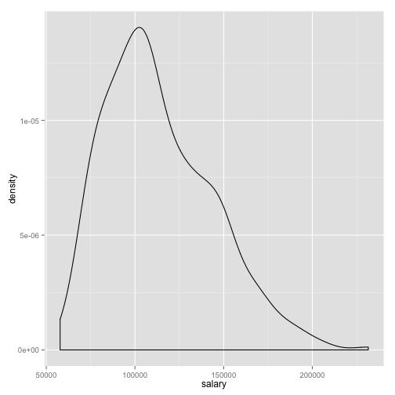 

```r
ggplot(Salaries, aes(x=salary, fill=rank)) + 
    geom_density(alpha=0.3)
```

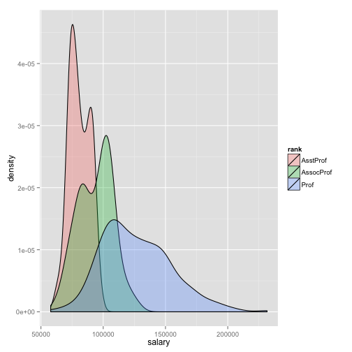 

```r
ggplot(Salaries, aes(x=yrs.since.phd, y=salary, shape=sex, color=rank)) + 
    geom_point()
```

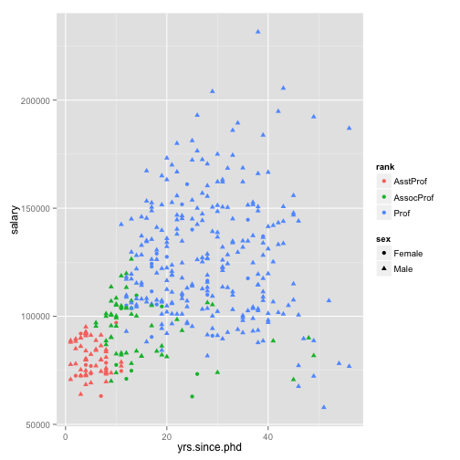 

---

## Faceting

#### Using ```facet_wrap```


```r
data(singer, package="lattice") 
library(ggplot2) 

ggplot(data=singer, aes(x=height)) + 
    geom_histogram() + 
    facet_wrap(~voice.part, nrow=4)
```

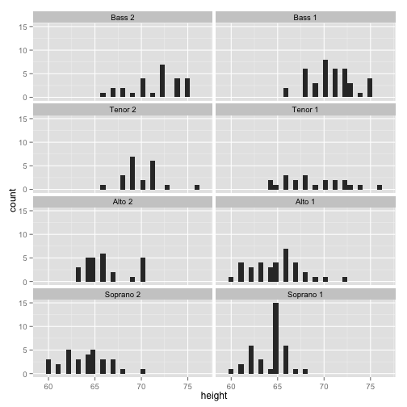 

#### Using ```facet_grid```


```r
m <- mtcars

m$am <- factor(m$am, levels=c(0,1), labels=c("Automatic", "Manual")) 

m$vs <- factor(m$vs, levels=c(0,1), labels=c("V-Engine", "Straight Engine")) 

m$cyl <- factor(m$cyl)

ggplot(data=m, aes(x=hp, y=mpg, shape=cyl, color=cyl)) + 
    geom_point(size=3) + 
    facet_grid(am~vs) + 
    labs(title="Automobile Data by Engine Type", 
         x="Horse Power", y="Miles Per Gallon")
```

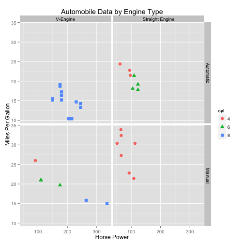 

---

## Arranging Plots into Grids

Install the ```gridExtra``` package


```r
library(gridExtra)

p1 <- ggplot(data=mtcars, aes(x=wt, y=mpg, color=factor(cyl))) + 
    geom_point(pch=17, color="blue", size=2) + 
    geom_smooth(method="lm", color="red", linetype=2) + 
    labs(title="Automobile Data", x="Weight", y="Miles Per Gallon")

p2 <- ggplot(data=mtcars, aes(x=wt, y=mpg, color=factor(cyl))) + 
    geom_point(pch=17, color="blue", size=2) + 
    geom_smooth(method="loess", color="red", linetype=2) + 
    labs(title="Automobile Data", x="Weight", y="Miles Per Gallon")

grid.arrange(p1,p2,ncol=2)
```

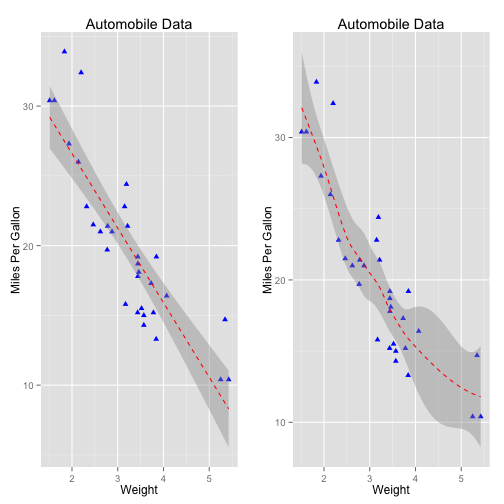 

```r
grid.arrange(p1,p2,nrow=2)
```

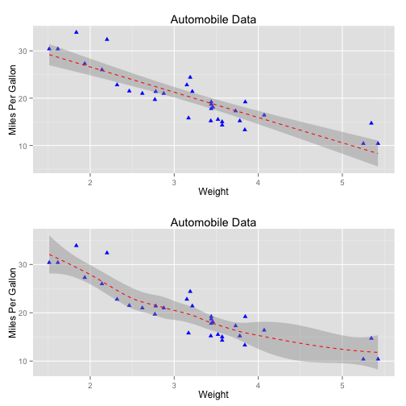 

---

## Modifying the appearance of ggplot2 graphs

+ Axes
+ Legends
+ Scales
+ Themes

---

## Saving plots to disk


```r
ggplot(mtcars,aes(x=wt, y=hp)) + 
    geom_point()
```

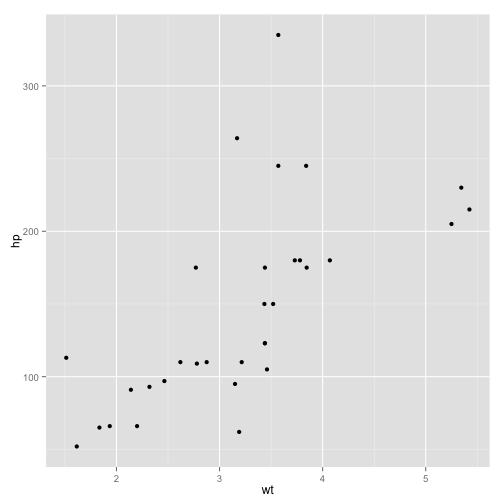 

```r
ggsave("myplot.pdf")
```

```
## Saving 7 x 7 in image
```

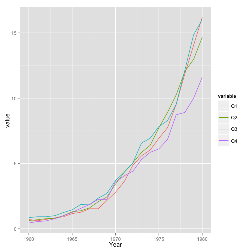 

```r
ggsave("myplot.png")
```

```
## Saving 7.39 x 4.93 in image
```

